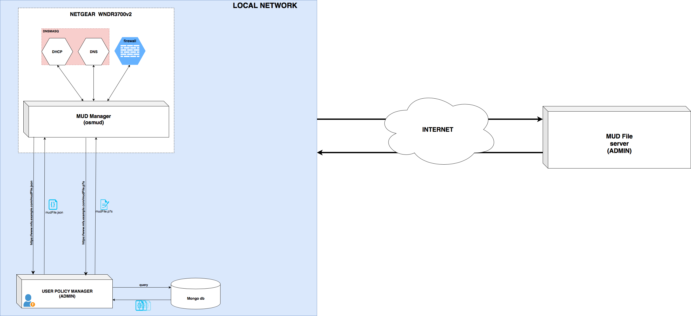
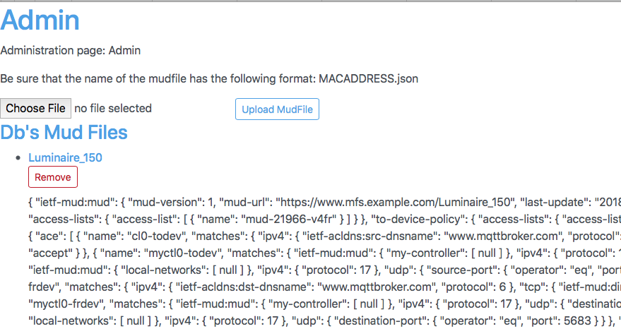

# User Policy Server

This project is born as mud file server for local network and transformed in a User Policy Server.

**N.B.** IT WAS TESTED WITH [OSMUD](https://github.com/osmud/)

## SETUP

### Requirements

```
mongodb openssl
```

### Architecture used


In this architecture, the UPS gives the possibility to an administrator to introduce more restrictive rules. 

The UPS is a restful server, which works together with mongo db.
To insert files in mongo db, you can use the following script

`
node populationdb.js mongodb://127.0.0.1/mudFile
`

This will insert in a db called **mudFile** all the mudfiles present in the directory *examples* (such as the one already present *Luminaire_150.json*).

At run-time you can insert other mud file, which will be used to create more restrictive rules. To do that, you have to use the section admin (https://yourserver/admin). In the future the identity of the admin must be checked!



**Pay attention**: The file must respect the following syntax:

*mac-address.json*

In this way we can identify the association between device and mud-file.

For now, the file inserted have the same structure described by the specification, but in the future they will have some additional features which will allow the representation of more restrictive rules.
After that you can install all the requirements of the server by using npm:

`
npm install
`

It's important that you have created a CA architecture before of starting the server. This means that you must have

* server key (used to generate the certificate request)
* server certificate (signed by a certification authority)

At the end you have to have a list of certificates like this:


`server.crt` is the server certificate in the crt format. (**mandatory**)

`server.csr` represent the certificate request. (**mandatory**)

`server.key` is the private key of the server. (**mandatory**)

`server.key.secure` is the private key of the server protected by a passphrase. (**optional**)

``server.pem`` is the server certificate in pem format.

**N.B.** The names of the certifcates must follow the above nomenclature, otherwise you will have some errors runtime. Futhermore, certificates and key must be collocated in the *certs* directory.

If you wanto to create your own Certification Authority, as I did, I suggest to use this [guide](https://help.ubuntu.com/lts/serverguide/certificates-and-security.html).

Now you can run the server:

`sudo npm run`

(sudo is required because the servers uses a port lower then 1024 (HTTPS port))

## HOW TO use

`https://yourbeautifullink.com/admin` --> *Admin page*

`https://yourbeautifullink.com/info` --> *Simple initial page*

`https://yourbeautifullink.com/` --> *Shows all the mud files stored in the db*

`https://yourbeautifullink.com/mudfilename.json` --> *Shows the specified mudFile*

`https://yourbeautifullink.com/mudfilename.p7s` --> *Shows the mud file signature*

## USAGE Example

As shown in the architecture figure, this server is thought to be used in a local network in which is used osMUD as mud manager implementation. Particularly, for this case we have modified the implementation, in order to do an additional request to this server after having requested the main mud file to the manufacture server. 

You can find the variant of osMUD implementation [here](https://github.com/aferaudo/osmud). If the implementation doesn't work is because is still in a developing phase, so try the branch **testing**.