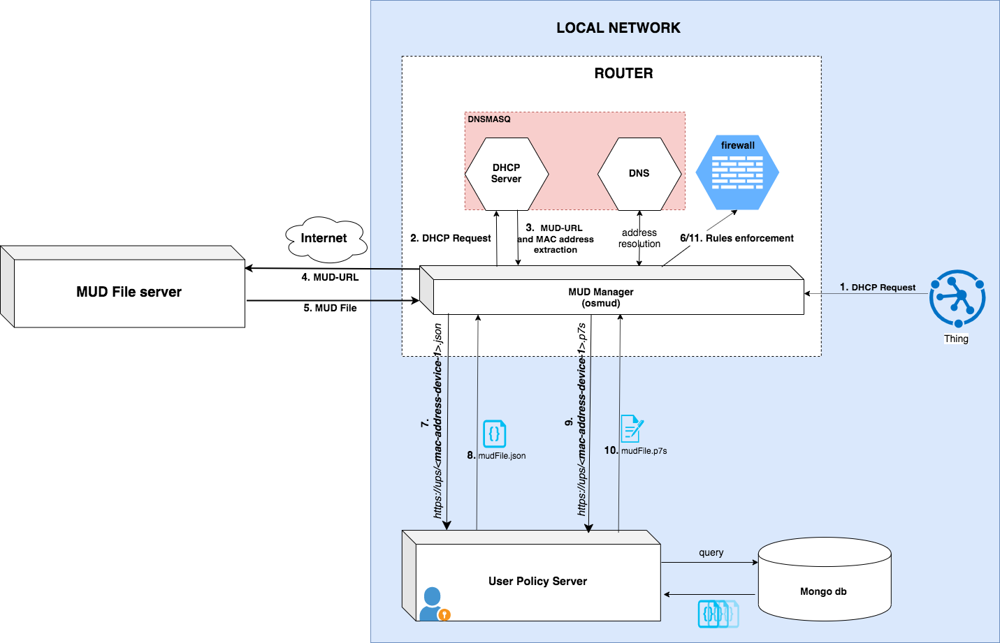

# User Policy Server

This project is born as mud file server for local network and transformed in a User Policy Server.

**N.B.** IT WAS TESTED WITH [OSMUD](https://github.com/osmud/)

## SETUP

### Requirements

```
mongodb openssl
```

### Architecture used


In this architecture, the UPS gives the possibility to an administrator to introduce more restrictive rules. 

The UPS is a restful server, which works together with mongo db.
To insert files in mongo db, you can use the script in the directory `script` as follow

`
node populationdb.js mongodb://yourusername:yourpassword@ip:port/mudFile ./json_files
`

This will insert in a db called **mudFile** all the mudfiles present in the directory *json_files* (such as the one already present *Luminaire_150.json*).

At run-time you can insert other mud file, which will be used to create more restrictive rules. To achieve this, you need to create a user and generate the MUD file using the MAC address nomenclature. Alternatively, you can create an admin user with the privilege to insert any type of MUD file, disregarding the MAC address nomenclature. 


**N.B.**: The file must adhere to the following syntax when not using admin privileges:

*mac-address.json*

In this way we can identify the association between device and mud-file.

For now, the file inserted has the same structure described by the specification, but in the future they will have some additional features which will allow the representation of more restrictive rules. See [example](./mudfs/examples/json_files/smart_hubs.json)


A CA architecture should be created before of starting the server. This means you to generate:

* server key (used to generate the certificate request)
* server certificate (signed by a certification authority)

At the end you have to have a list of certificates like this:


`server.crt` is the server certificate in the crt format. (**mandatory**)

`server.csr` represent the certificate request. (**mandatory**)

`server.key` is the private key of the server. (**mandatory**)

`server.key.secure` is the private key of the server protected by a passphrase. (**optional**)

``server.pem`` is the server certificate in pem format.

**N.B.** The names of the certifcates must follow the above nomenclature, otherwise you will have some errors runtime. Futhermore, certificates and key must be collocated in the *certs* directory.

If you want to create your own Certification Authority, as I did, I suggest to use this [guide](https://ubuntu.com/server/docs/security-certificates).

Alternatively, you can use a self-signed certificate, which, however, require the configuration on the MUD manager. **The MUD server should be a Trusted Entity.**

```bash
# Self certificate procedure
cd mudfs/certs
openssl genrsa -out server.key
openssl req -new -key server.key -out csr.pem
openssl x509 -req -days 9999 -in csr.pem -signkey server.key -out server.pem
rm csr.pem
cp server.key server.key.pem 
```


After that you can install all the requirements of the server by using npm:

`
npm install
`

Configure a .env file for db secure connection and other settings. Please refer to the [.env.example](./mudfs/.env.example) file

Try that everything works:
`
npm test
`


Now, you can run the server:

`npm start`


## HOW TO use

<!-- `https://yourbeautifullink.com/admin` *Admin page* -->

`https://yourbeautifullink.com/info` --> *Simple initial page*

`https://yourbeautifullink.com/` --> *Shows all the mud files stored in the db*

`https://yourbeautifullink.com/mudfilename.json` --> *Shows the specified mudFile*

`https://yourbeautifullink.com/mudfilename.p7s` --> *Shows the mud file signature*

## USAGE Example

As shown in the architecture figure, this server is thought to be used in a local network in which is used osMUD as mud manager implementation. Particularly, for this case we have modified the implementation, in order to do an additional request to this server after having requested the main mud file to the manufacture server. 

You can find the variant of osMUD implementation [here](https://github.com/aferaudo/osmud). If the implementation doesn't work is because is still in a developing phase, so try the branch **testing**.

Futhermore, [here](https://arxiv.org/pdf/2004.08003.pdf) you can find a white paper that describes in details this architecture and gives an overview of the exisisting MUD technologies. You can also find some tests on the performance of this architecture.

**N.B. This implementation can be used as a traditional MUD FILE SERVER**

## Containerization using Docker
If you want to run the mudfs inside a docker container run
```
docker-compose --env-file .my-env up -d
```
In the user_policy_server directory. **You should configure the .env file before doing this.**