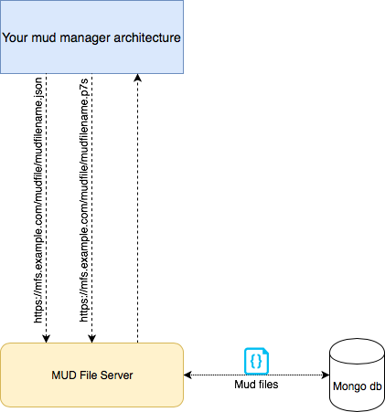
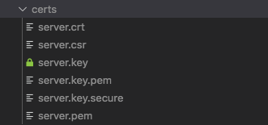

# MUD FILE SERVER

This is an example of MUD file server. It could be used for local project and example.

## SETUP

### Requirements

```
mongodb openssl
```

### Architecture used


It is noticeable from the architecture, that we need to insert the mudfiles in the db. To do that you can use the node script that is in the directory examples by launching the following command:

`
node populationdb mongodb://127.0.0.1/mudFile
`

This will insert in a db called **mudFile** all the mudfiles present in the directory example (such as the one already present *Luminaire_150.json*).

After that you can install all the requirements of the server by using npm:

`
npm install
`

It's important that you have created a CA architecture before of starting the server. This means that you must have
* server certificate (signed by the certification authority)
* server key (used to generate the certificate request)

At the end you have to have a list of certificate like this:



`server.crt` is the server certificate in the crt format. (**mandatory**)

`server.csr` represent the certificate request. (**mandatory**)

`server.key` is the private key of the server. (**mandatory**)

`server.key.secure` is the private key of the server protected by a passphrase. (**optional**)

``server.pem`` is the server certificate in pem format.

**N.B.** The names of the certifcates must follow the above nomenclature, otherwise you will have some errors runtime. Futhermore, certificates and key must be collocated in the *certs* directory.

If you wanto to create your own Certification Authority, as I did, I suggest to you to use this [guide](https://help.ubuntu.com/lts/serverguide/certificates-and-security.html).

Now you can run the server:

`sudo npm run`

(sudo is required because the servers uses a port lower then 1024 (HTTPS port))

## HOW TO use

`https://yourbeautifullink.com/` --> *Initial page*

`https://yourbeautifullink.com/mudfile/all` --> *Shows all the mud files stored in the db*

`https://yourbeautifullink.com/mudfile/mudfilename.json` --> *Shows the specified mudFile*

`https://yourbeautifullink.com/mudfile/mudfilename.p7s` --> *Return the mud file signature*